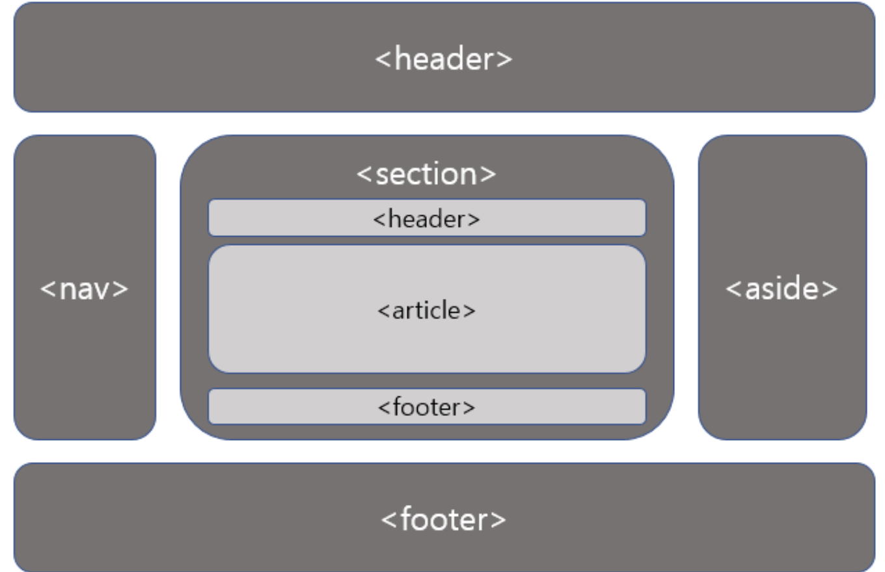
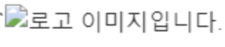

# SEO란?

- SEO란 간단하게 검색엔진 최적화라고 한다.
- 말 그대로 나의 작업물이 검색을 했을 때 <strong>상위에 노출</strong>이 될 수 있도록 만든 것이라고 생각해보자!!

# 검색 원리

- 나는 기본적으로 구글이 검색할 때 가장 좋다고 느껴서 구글의 검색엔진이 어떻게 작동하는지 찾아봤다.

> 구글의 검색은 <strong>3단계(크롤링, 색인생성, 검색엔진 제제)</strong>로 이루어져 있다고 한다
>
> 1. 크롤링 : 크롤러라는 자동화된 프로그램을 사용해 인터넷에서 찾은 데이터(텍스트,이미지)등을 다운로드 한다고 한다.
> 2. 색인 생성 : 크롤링이 완성 되면, 페이지 내용을 파악하는 단계 (title요소, img의 alt 속성, 동영상, 텍스트등 분리하는 단계이다). 또 한 인터넷에 있는 다른 페이지와 중복이 되는지도 체크한다고 한다
> 3. 검색결과 제제 : 페이지를 검색한 다음 품질이 가장 높고 사용자의 검색어와 가장 관련성이 크다고 판단되는 결과를 반환한다고 한다. 관련성은 사용자의 위치 언어, 기기 등을 통해 다르게 검색된다고 한다.

더욱 자세한 내용을 얻고 싶다면 다음 사이트를 접속해서 보자!!
출처 : <a href='https://developers.google.com/search/docs/fundamentals/how-search-works?hl=ko' alt="구글 검색 최적화 사이트"> https://developers.google.com/search/docs/fundamentals/how-search-works?hl=ko</a>

# HTML에서 SEO 최적화 하는 방법

#### 1. 페이지 타이틀 `<title></title>`

```html
<!doctype html>
<html lang="ko">
  <head>
    <meta charset="UTF-8" />
    <meta name="viewport" content="width=device-width, initial-scale=1.0" />
    <title>Document</title>
  </head>
  <body></body>
</html>
```

- 위의 html 코드를 보면 title이 있는데 이 title은 SEO 최적화를 위해서는 오직 text로만 사용해야 하고, 페이지 마다 적절한 이름과 최대한 간결하게 작성을 해보자.
  ex) <strong>마이페이지 | 무신사</strong>

#### 2. 올바른 meta 태그 사용

✅ charset
`<meta charset="UTF-8" />` 기본적으로 위와 같은 charset을 볼 수 있는데 utf-8로 모든 언어를 웹페이지에 표현이 가능하다고 한다.

✅ description
페이지의 내용을 간략하게 요약해서 설명하는 태그이다. description의 경우 일반적으로 150~160자 내외로 작성하고, 주요 키워드를 1~2번 작성해서 사용하는 것이 좋다고 한다.
좋은 예시 :

```html
<meta
  name="description"
  content="재봉틀로 옷을 만들 때 필요한 모든 제품이 준비되어 있습니다. 영업 시간: 월요일~금요일, 오후 8~5시, 위치: 패션 디스트릭트"
/>
```

✅ name="robots"
해당 페이지를 검색결과에 표시할지(index) 표시하지 않을지(noindex),
그리고 페이지 안에 있는 링크를 따라 이동하게 할 것인지(follow) 아닌지(nofollow)를 지정할 수 있다.

- 🤔 이거를 왜 사용할까 했는데 요즘, 유튜브나 다른 블로그 글의 댓글중에 몇몇 스팸성 댓글이 있는데 이를 방지할수 있을거 같다.

```html
사용법
<meta name="robots" content="all" />
<meta name="robots" content="index,follow" />
<meta name="robots" content="noindex,follow" />
<meta name="robots" content="index,nofollow" />
<meta name="robots" content="noindex,nofollow" />
```

✅ name="viewport"
viewport 태그는 모바일 디바이스에서 어떻게 표시될지 정의하는 태그이고, 검색 엔진 순위에 영향을 미칠 수 있다고 한다.

#### 3. 시맨틱 태그

아마 대부분 마크업을 할 때 div 태그를 많이 사용하는데 HTML 구조를 한번에 알아 볼 수 있는 <strong>Semantic Tag</strong>가 검색엔진 최적화에 도움을 준다고 한다.

출처 : <a href='https://thrillfighter.tistory.com/492' alt="SemanTic markUp 사진출처 URL">https://thrillfighter.tistory.com/492</a>
위의 사진 처럼 HTML의 구조를 시맨틱 태그를 이용해서 만들어보는 것이 좋을 거 같다.

#### 4. URL 구조

- 마이페이지의 URL 구조가 만약 https://www.naver.com/12313.html 이런식으로 되어있다면, 사용자와 검색엔진 또한 찾이 어렵다. https://www.naver.com/mypage.html 다음과 같이 짧고 어떤 페이지인지 알기 쉽게 URL을 만들어보자!!

#### 5. 이미지 최적화

- alt 속성 꼭 사용해주기, 이미지가 깨져 있을 때, alt로 어떤 이미지 였는지 작성해주면 좋다!!
  <br> 
- 간결하고 설명쉬운 파일 이름 사용
  ex)<br>
  logo.png -> 🎉<br>
  123.png -> ❌
