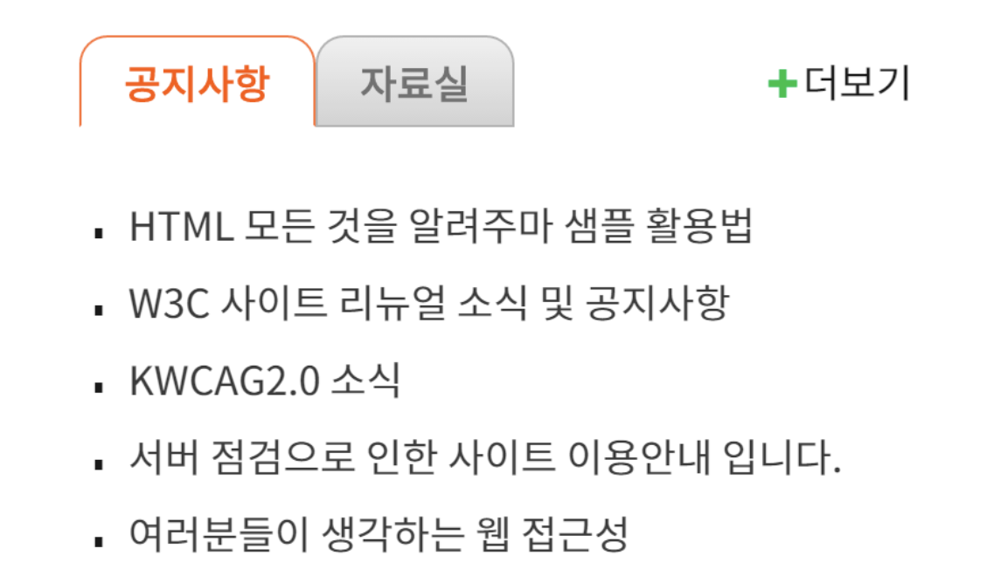

# 웹 접근성2일차

- 웹 접근성과 관련해서 내용이 생각보다 많아서 나눠서 공부를 진행할려고 한다!!
  <br/>

## 동적 변경 알려주기

> 사용자에게 동적으로 변경되는 경우 or 업데이트 된 요소를 알려줄 수 있는 방법<strong>(aria-live와 aria-atomic)</strong>이 있다!

1. <strong>aria-live</strong>의 경우 기본 값은 off로 되어있고 이 경우는 업데이트 된 정보를 사용자에게 알려주지 않는다. 하지만 polite이라는 속성을 지정하면, 사용자가 값을 마치면 업데이트 된 내용을 스크린 리더가 알려준다. 또 다른 속성 assertive가 있는데 이 속성은 업데이트 된 내용을 즉시 알려준다!!<br/>

2. <strong>aria-atomic</strong>은 true와 false 두 가지 속성이 있고, false의 경우 업데이트 된 내용을 포함한 전체 내용을 모두 읽는 특징이 있다. true는 업데이트 된 내용만 읽는다고 한다.
   <br/>

## 탭 UI

- 사용자가 탭 UI를 사용했을 떄 어떻게 더 접근하기 쉽고 접근성 까지 보완할 수 있을까?
  

- 아래 사진을 봤을 때 화면에 보이는 순서를 생각했을 떄 공지사항 -> 자료실 -> 더보기 이러한 목록 순으로 생각했을 때, 현재 사용자가 어떤 목록의 데이터를 보고 있는지 이해가 명확하지 않다고 한다. 🤔
  <br/>
- 그래서 수정을 공지사항 -> 공지사항 목록 -> 공지사항 더보기 링크 처럼 마크업을 변경하면 사용자가 더욱 이해가 쉽다고 한다.
  `이 글을 읽고 나 자신이 많이 반성되었다. 😦 항상 눈에 보이는거 대로 해도 괜찮을거라고 생각했었는데... 이 문서 작업이 끝나면 따로 html로만 마크업을 다시 공부해야 겠다는 생각이 들었다.. `

  <br/>

# 여태까지 정리한거를 토대로 웹 페이지 제작해보기!!

- 링크 : https://github.com/chohyundon/web-pracitce?tab=readme-ov-file

## 프로젝트에서 신경써서작업했던 부분들

- 최대한 div 태그를 사용하지 않고 시맨틱 태그들만!! (평소 div 태그를 남용해서!!)
  <br/>

- tabindex 사용해보기 (프로젝트를 보면 링크들이나 main의 탭 UI에 tabindex를 도입했다!)
  <br/>

- aria-label && aria-labelledby 사용하기 (li 태그들 중에 링크 태그들이 있는데 어떤 링크로 이동하는지 aria-label을 통해 의미를 부여했고, role = group일 떄 어떤 group인지 aria-labelledby을 통해 알려주었다)

## 만들면서 배운 점 !! ✅

- 여태까지 리액트나 넥스트를 작업하면서 항상 div로만 사용해서 작업했던 것과는 반대로 정말 코드를 수정해야하는 부분이 있을 떄, 훨씬 찾기가 수월했다.
  <br/>
- 생각보다 마크업하는 데에 시간이 많이 필요했다. div로 도배해왔던 전과는 반대로 div태그보다 semantic 태그를 최대한 사용해보고자 하였고, 코드의 유지보수 측면이나 확장을 해야할때 더욱 수월할거 같다고 생각이 들었다.
  <br/>
- 뭔가 구조를 머리속으로만 생각하지 않고 직접 섹션을 나눠서 구조를 짜면 좋을거 같다는 생각이 들었다.
  <br/>

## 보완하면 좋을 점들 !! 👨🏻‍💻

- 이미지 태그를 작업하던 중 figure 태그를 사용할까 말까 고민을 많이 했는데 이 figure 태그를 좀더 알아가면 좋을거 같다... (figure 태그는 독립적으로 사용한다는데 .. 음 아직 좀더 작업을 하면서 더 찾아봐야 겠다!!)
  <br/>

- 탭 UI를 제작하면서 똑같은 실수를 해버렸다.. 물론 수정은 작업하면서 <strong>마지막에 깨달았지만 </strong>아직 탭 UI를 작업할 때 제목 -> 콘텐츠 순으로 가야하는데... 아직도 제목요소 다 만들고 컨텐츠를 작업한다...

```html
<div class=“tab-interface”>
    <ul class=“tab-list”>
      <li><a href=“/”>공지사항</a></li>
      <li><a href=“/”>자료실</a></li>
    </ul>
  <div class=“tab-contents”>
    <ul class=“notice-list”>
      <li><a href=“/”>HTML 모든 것을 알려주마 샘플 활용법</li>
      <li><a href=“/”>W3C 사이트 리뉴얼 소식 및 공지사항</li>
      <li><a href=“/”>KWCAG2.0소식</li>
      <li><a href=“/”>서버 점검으로 인한 사이트 이용안내</li>
      <li><a href=“/”>여러분들이 생각하는 웹접근성</li>
    </ul>
    <ul class=“pds-list”>
      <li><a href=“/”>시각장애인에 닫힌 모바일 앱</li>
      <li><a href=“/”>개도국 정보화 격차 해소</li>
      <li><a href=“/”>민간분야 웹 사이트 장애인 접근성 취약</li>
      <li><a href=“/”>서버 점검으로 인한 사이트 이용안내</li>
      <li><a href=“/”>웹 창시자 “웹의 권리장전 필요하다”</li>
    </ul>
    <a href=“/” class=“more”>더보기</a>
  </div>
</div>
```

- (위 코드처럼 li를 두개 다 마크업을 하고 콘텐츠를 작성했다는 것을 보여주는 예시이다.)

```html
<div class=“tab-interface”>
  <div class=“tab-contents”>
    <div id=“notice” class=“on”>
    <h1><a href=“/”>공지사항</a></h1>
    <ul class=“notice-list”>
    <li><a href=“/”>HTML 모든 것을 알려주마 샘플 활용법</li>
    <li><a href=“/”>W3C 사이트 리뉴얼 소식 및 공지사항</li>
    <li><a href=“/”>KWCAG2.0소식</li>
    <li><a href=“/”>서버 점검으로 인한 사이트 이용안내</li>
    <li><a href=“/”>여러분들이 생각하는 웹 접근성</li>
  </ul>
  <a href=“/” class=“more” title=“공지사항”>더보기</a>
  </div>
  <div id=“pds”>
   <h1><a href=“/”>자료실</a></h1>
    <ul class=“pds-list”>
    <li><a href=“/”>시각장애인에 닫힌 모바일 앱</li>
    <li><a href=“/”>개도국 정보화 격차 해소</li>
    <li><a href=“/”>민간 웹 사이트 장애인 접근성 취약</li>
    <li><a href=“/”>서버 점검으로 인한 사이트 이용안내</li>
    <li><a href=“/”>웹 창시자 “웹의 권리장전 필요하다”</li>
    </ul>
   <a href=“/” class=“more” title=“자료실”>더보기</a>
    </div>
  </div>
</div>
```

- 위와 같이 올바르게 마크업을 해보자!!
  <br/>
